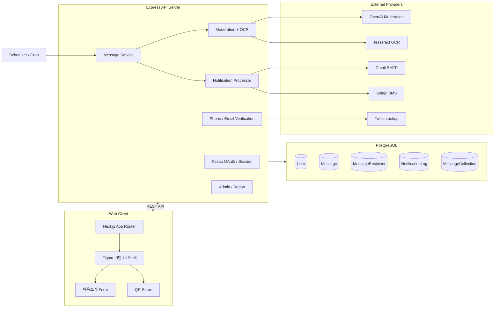

# 매아리 서비스 소개 자료

> “지금 남긴 마음이, 가장 필요한 순간에 조용히 도착합니다.”

**매아리(Maeari)** 는 사용자가 지금의 마음, 응원, 감사, 축하, 위로를 미래의 특정 시점에 자신 또는 타인에게 전달할 수 있도록 돕는 **예약 메시지 서비스**입니다.

매아리는 단순히 메시지를 보내는 도구가 아닙니다. 마음을 쓰고, 도착할 시간을 정하고, 그 시간이 되었을 때 앱 안의 받은 마음함, 이메일, 문자, 공개 링크, QR을 통해 안전하게 도착시키는 **감성 전달 플랫폼**입니다.


---

## 프로젝트 소개

### 서비스명

**매아리 = 매 순간 아껴둔 마음의 소리**

### 한 줄 설명

> 매아리는 현재의 마음을 미래의 어느 순간에 도착시키는 예약 메시지 서비스입니다.

### 핵심 문장

> 매아리는 메시지를 보내는 서비스가 아니라, 마음이 가장 필요한 순간에 도착하게 만드는 서비스입니다.

---

## 기획 의도

우리는 마음을 자주 놓칩니다.

- 생일 전날에는 기억했지만 당일에는 바빠서 축하를 놓칩니다.
- 위로하고 싶은 말은 있었지만, 막상 그 순간에는 전하지 못합니다.
- 미래의 나에게 남기고 싶은 말은 메모장 속에서 잊힙니다.
- 직접 말하기 어려운 마음은 익명성이나 시간이 필요합니다.

**매아리** 는 이런 “마음의 타이밍”을 지키기 위해 만들어졌습니다.

사용자는 지금의 감정을 편지처럼 남기고, 도착할 날짜와 시간을 정합니다. 그리고 그 시간이 되면 매아리가 메시지를 앱 안의 받은 마음, 이메일, 문자, 공개 링크로 전달합니다.


---

## 사용자 이해를 돕는 설명 방식

매아리를 설명할 때는 기능을 먼저 나열하기보다, 다음 흐름으로 이야기하는 것이 가장 이해하기 쉽습니다.

```txt
1. 마음을 전하고 싶은 순간이 있다.
2. 그런데 지금 보내기에는 이르거나, 직접 말하기 어렵다.
3. 매아리에서 마음을 쓰고 도착 시각을 예약한다.
4. 시간이 되면 수신자에게 마음이 도착한다.
5. 수신자는 읽고, 답장하고, 보관할 수 있다.
```

즉, 발표와 문서에서는 “예약 메시지 앱”보다 **“마음이 도착하는 경험”** 을 중심으로 설명해야 합니다.

---

## 주요 기능

| 기능 | 설명 |
| --- | --- |
| **예약 마음쓰기** | 현재의 마음을 제목, 본문, 감정태그, 이미지와 함께 작성하고 미래 도착 시간을 정합니다. |
| **미래의 나 / 친구 / 외부 수신자** | 나 자신, 친구, 이메일/전화번호를 가진 비회원에게 마음을 보낼 수 있습니다. |
| **도착 시간 설정** | 빠른 프리셋, 날짜 선택, 1분 단위 시간 입력, 랜덤 도착, 도착 전 힌트를 지원합니다. |
| **이메일 / SMS 외부 전달** | 비회원 수신자는 Gmail SMTP 이메일 또는 Solapi 문자로 공개 열람 링크를 받습니다. |
| **공개 링크와 QR 공유** | 공개 URL을 QR로 표시하고, 링크 복사와 QR 저장을 지원합니다. |
| **받은 마음과 보관함** | 도착한 마음을 읽고 보관하거나 삭제할 수 있습니다. |
| **보낸 마음과 답장함** | 예약/완료/실패 상태를 확인하고, 공개 링크 답장을 답장함에서 볼 수 있습니다. |
| **친구 기능** | 친구 코드, 닉네임 검색, 친구 요청, 초대 링크로 반복 수신자를 쉽게 관리합니다. |
| **마음나무** | 하나의 공개 링크에 여러 사람이 마음을 남기고, 정한 시간에 한 번에 받아볼 수 있습니다. |
| **감정 리포트** | 주고받은 마음의 감정 흐름을 돌아볼 수 있습니다. |
| **안전한 전달** | OpenAI Moderation, 서비스 guardrail, 한국어 보강 규칙, 이미지 OCR 검사를 적용합니다. |
| **어뷰징 방지** | 마음쓰기 권한은 strict 010 휴대전화 인증을 기준으로 관리합니다. |

---

## Main Features

## 1. Core Experience

---

### 마음쓰기: 지금의 마음을 미래로 보내기

사용자는 `/write` 화면에서 마음을 작성합니다.

핵심 입력:

- 수신 대상: 미래의 나, 친구, 이메일/전화번호 수신자
- 제목과 본문
- 감정 태그
- 이미지 첨부
- 도착 날짜와 시간
- 랜덤 도착 여부
- 도착 전 힌트
- 익명 전송
- 도착일 숨김
- 답장 허용


사용자가 이해해야 할 핵심은 간단합니다.

> 매아리에서는 “무엇을 쓸지”뿐 아니라 “언제, 어떤 방식으로 도착할지”까지 정할 수 있습니다.

---

### 예약 도착: 시간이 되면 마음이 찾아오기

예약된 메시지는 서버 scheduler가 도착 시간을 확인해 처리합니다.

도착 방식:

- 회원 수신자: 서비스 안의 받은 마음함
- 친구 수신자: 친구의 받은 마음함
- 비회원 수신자: 이메일 또는 SMS 공개 링크
- 공개 링크 수신자: 로그인 없이 열람 가능
- 이후 가입한 수신자: 기존 공개 링크 메시지를 수신함으로 귀속 가능


---

### 보낸 마음: 예약과 도착 상태 추적

`/sent` 화면은 사용자가 보낸 마음의 상태를 보여줍니다.

확인 가능한 상태:

- 예약 대기
- 전달 완료
- 전달 실패
- 취소됨
- 답장 도착

사용자는 보낸 마음에서 예약을 취소하거나, 링크/QR을 다시 확인하거나, 도착한 답장을 볼 수 있습니다.

---

### 받은 마음: 도착한 마음을 간직하기

`/inbox`와 `/archive`는 도착한 마음을 읽고 보관하는 공간입니다.

기능:

- 받은 마음 목록
- 읽음/안 읽음 상태
- 마음 보관함 이동
- 보관 해제
- 삭제
- 감정 태그 필터

서비스를 감성적으로 이해시키려면 이 기능을 이렇게 설명하는 것이 좋습니다.

> 매아리는 메시지를 일회성 알림으로 끝내지 않고, 다시 꺼내볼 수 있는 기억으로 남깁니다.


---

## 2. Relationship Feature

---

### 친구: 자주 마음을 주고받는 사람 연결

매아리는 친구 기능을 통해 반복적으로 마음을 주고받는 사람을 연결합니다.

기능:

- 친구 코드
- 닉네임 또는 친구 코드 검색
- 친구 요청
- 친구 요청 수락/거절/취소
- 친구 목록
- 1회성 친구 초대 링크

친구가 된 사용자는 마음쓰기 화면에서 수신자로 바로 선택할 수 있습니다.

---

### 마음나무: 여러 사람의 마음을 한 순간에 받기

**마음나무** 는 매아리의 확장 기능입니다.

사용자는 하나의 공개 링크 또는 QR을 만들고, 다른 사람들이 그 링크에 마음을 남깁니다. 정해진 시간이 되면 모인 마음이 한 번에 공개됩니다.

활용 예시:

- 생일 축하 메시지 모으기
- 졸업 축하 편지
- 친구 응원 이벤트
- 프로젝트 팀 회고
- 기념일 서프라이즈


---

## 3. Safety & Trust

---

### AI 유해성 검사

감성 메시지 서비스에서 중요한 것은 “마음이 안전하게 도착하는 것”입니다.

매아리는 메시지 저장 전 여러 단계의 검사를 거칩니다.

검사 흐름:

```txt
사용자 메시지 작성
  -> 한국어 욕설/비하 표현 로컬 검사
  -> OpenAI Moderation
  -> 매아리 서비스 정책 guardrail prompt
  -> 통과 시 예약 저장
  -> 실패 시 사용자에게 부드러운 안내
```

검사 대상:

- 욕설
- 혐오 표현
- 비하 표현
- 성적 모욕
- 수신자에게 상처가 될 수 있는 공격적 표현

---

### 이미지 OCR 검사

이미지에 들어간 텍스트도 안전 검사 대상입니다.

매아리는 Vision API로 이미지 전체를 판단하지 않고, 서버에서 `tesseract.js` 기반 OCR로 텍스트를 추출한 뒤 기존 유해성 검사에 합칩니다.

지원 이미지 형식:

- `.jpg`
- `.jpeg`
- `.png`
- `.webp`

흐름:

```txt
이미지 첨부
  -> MIME/확장자/매직바이트 검증
  -> OCR 텍스트 추출
  -> 메시지 본문 + OCR 텍스트를 함께 moderation
  -> 통과 시 저장
```

---

### 휴대전화 인증과 어뷰징 방지

마음쓰기 권한은 이메일 인증이 아니라 **strict 010 휴대전화 인증**으로 부여됩니다.

구성:

- OTP 인증
- Twilio Lookup v2 회선 검사
- 한국 010 mobile 번호만 허용
- IP/전화번호 rate limit
- 잠금 정책
- 원본 IP/전화번호 대신 HMAC hash 저장

발표에서는 이렇게 설명하면 좋습니다.

> 누구나 마음을 받을 수는 있지만, 아무나 무분별하게 마음을 보내지는 못하도록 인증과 rate limit을 둡니다.

---

### 이메일/SMS 알림과 수신거부

비회원 수신자는 이메일 또는 문자로 공개 링크를 받습니다.

구성:

- Gmail SMTP 이메일 발송
- Solapi SMS 발송
- NotificationLog 기록
- 실패 재시도
- 이메일/SMS 수신거부
- 수신거부 연락처 HMAC hash 저장

중요 정책:

> 이메일과 문자 본문에는 사용자가 작성한 편지 내용을 넣지 않고, 열람 링크와 도착 안내만 포함합니다.

---

## 시스템 아키텍처



---

## Core Workflow

## 1. 마음 작성

사용자는 웹에서 메시지를 작성합니다.

입력:

- 수신자
- 제목
- 본문
- 감정 태그
- 이미지
- 도착 시각
- 전달 옵션

프론트엔드는 JSON 또는 multipart form-data로 API에 전달합니다. 이미지가 있으면 `payload` 필드에 JSON을 담고, `attachments` 필드에 파일을 담습니다.

---

## 2. 안전 검사

서버는 메시지를 저장하기 전 검사를 수행합니다.

```txt
본문 텍스트
첨부 이미지 OCR 텍스트
  -> 로컬 한국어 규칙
  -> OpenAI Moderation
  -> 매아리 guardrail prompt
```

통과하면 예약 메시지로 저장되고, 실패하면 사용자에게 안내됩니다.

---

## 3. 예약 저장

메시지는 `Message`, 수신자는 `MessageRecipient`, 공개 링크는 `MessageAccessToken` 중심으로 저장됩니다.

핵심 상태:

- `PENDING`: 예약 대기
- `SENT`: 도착 완료
- `FAILED`: 전달 실패
- `CANCELED`: 취소
- `BLOCKED`: 유해성 차단
- `MODERATION_FAILED`: 검사 실패 후 재검사 대기

---

## 4. 도착 처리

Scheduler가 예약 시간을 확인합니다.

```txt
예약 시간 도래
  -> Message SENT 처리
  -> NotificationProcessor event emit
  -> 회원 수신자: IN_APP
  -> 외부 수신자: EMAIL 또는 SMS
  -> 공개 링크 활성화
```

---

## 5. 열람과 답장

수신자는 받은 마음함 또는 공개 링크에서 메시지를 읽습니다.

가능한 행동:

- 메시지 열람
- 보관
- 답장
- 신고
- 이메일/SMS 수신거부
- 가입 후 수신함 귀속

---

## User Interface

### 1. 홈


홈에서는 서비스의 정체성과 사용자의 최근 흐름을 보여줍니다.

- 현재 KST
- 곧 찾아갈 마음
- 최근 찾아온 마음
- 마음쓰기 / 받은 마음 / 친구 / 마음나무 quick card

### 2. 마음쓰기


마음쓰기 화면은 서비스의 핵심 화면입니다.

- 수신자 선택
- 제목/본문 작성
- 감정태그
- 이미지 첨부
- 도착 시간 설정
- 익명/도착일 숨김
- 랜덤 도착
- 도착 전 힌트

### 3. 보낸 마음


보낸 마음에서는 내가 예약한 메시지를 관리합니다.

- 예약함
- 전달 완료
- 전달 실패
- 답장함
- QR 보기
- 링크 복사
- 삭제/취소

### 4. 받은 마음


받은 마음은 도착한 메시지를 읽고 보관하는 공간입니다.

- 받은 마음 목록
- 읽음 상태
- 마음 보관함
- 감정 태그 필터

### 5. 친구


친구 화면은 반복적으로 마음을 주고받을 사람을 관리합니다.

- 친구 코드
- 친구 검색
- 받은 요청
- 보낸 요청
- 친구 초대 링크

### 6. 마음나무


마음나무는 여러 사람이 남긴 마음을 하나의 링크에 모아 정한 시간에 공개합니다.

- 새 마음나무 생성
- 공개 링크/QR 공유
- 비회원 편지 제출
- 도착 후 제출물 열람

### 7. 감정 리포트


감정 리포트는 내가 주고받은 마음의 감정 흐름을 돌아보는 화면입니다.

- 감정 태그 통계
- 월별 흐름
- 보낸 마음/받은 마음의 정서적 기록

---

## 발표 자료 구성 계획

3분 발표에서는 기능을 모두 설명하려 하지 말고, 사용자 여정 중심으로 보여주는 것이 좋습니다.

### 추천 슬라이드 7장

| 순서 | 제목 | 핵심 메시지 | 추천 이미지 |
| --- | --- | --- | --- |
| 1 | 매아리 | 매 순간 아껴둔 마음의 소리 | `maeari-hero-floral.png` |
| 2 | 문제 | 마음은 있는데 타이밍을 놓친다 | `maeari-star-letter.png` |
| 3 | 해결 | 쓰고, 예약하고, 도착한다 | `maeari-open-envelope.png` |
| 4 | 데모 | 마음쓰기부터 받은 마음까지 | 실제 화면 캡처 또는 `maeari-card-letter.png` |
| 5 | 안전장치 | 유해성 검사, OCR, 인증, 수신거부 | workflow mermaid |
| 6 | 확장 | 마음나무와 QR 공유 | `maeari-hero-night.png` |
| 7 | 마무리 | 마음이 가장 필요한 순간에 | `maeari-glow-envelope.png` |

### 3분 발표 시간 배분

```txt
0:00-0:20  Hook: 마음의 타이밍을 놓친 경험 질문
0:20-0:45  Problem: 왜 필요한 서비스인지
0:45-1:15  Solution: 쓰고, 예약하고, 도착한다
1:15-2:05  Demo: 마음쓰기, 보낸 마음, 받은 마음
2:05-2:35  Trust: moderation, OCR, 인증, 이메일/SMS
2:35-2:55  Expansion: 마음나무, QR, 친구
2:55-3:00  Closing: 핵심 문장 반복
```

### 발표 대본 초안

여러분은 지금은 꼭 전하고 싶지만, 오늘 보내기엔 조금 이른 마음이 있었나요?

매아리는 그런 마음을 미래의 어느 순간에 도착시키는 예약 메시지 서비스입니다. 이름은 “매 순간 아껴둔 마음의 소리”라는 뜻입니다.

우리는 마음을 자주 놓칩니다. 생일 전날엔 기억하다가 당일엔 바쁘고, 위로하고 싶은 말은 타이밍을 놓치고, 미래의 나에게 남기고 싶은 말은 메모장 속에 묻힙니다. 매아리가 해결하려는 문제는 단순한 메시지 전송이 아니라, 마음의 타이밍을 지키는 것입니다.

사용자는 마음쓰기 화면에서 미래의 나, 친구, 또는 연락처 수신자를 고르고, 제목과 본문, 감정태그, 이미지를 함께 남길 수 있습니다. 그리고 도착할 날짜와 시간을 직접 정하거나, 랜덤 도착과 힌트 알림을 설정할 수 있습니다. 익명으로 보내거나 도착 예정일을 숨기는 것도 가능합니다.

예약된 마음은 시간이 되면 도착합니다. 회원에게는 서비스 안의 받은 마음으로, 비회원에게는 이메일이나 문자 링크로 전달됩니다. 보낸 사람은 보낸 마음 화면에서 예약, 완료, 실패 상태를 확인하고, 받은 사람이 공개 링크에서 남긴 답장도 답장함에서 볼 수 있습니다. 받은 마음은 보관함에 간직할 수 있고, 감정 리포트로 내가 주고받은 마음의 흐름도 돌아볼 수 있습니다.

메시지 서비스에서 중요한 건 감성만이 아니라 안전입니다. 매아리는 텍스트 유해성 검사와 이미지 OCR 기반 검사를 거치고, 휴대전화 인증으로 마음쓰기 권한을 관리합니다. 이메일과 문자 알림은 수신거부와 재시도 로그를 남겨 운영 가능하게 만들었습니다.

마지막으로 마음나무는 여러 사람이 하나의 링크에 마음을 남기고, 정한 시간에 한 번에 받아보는 기능입니다. 생일, 졸업, 응원 이벤트처럼 여러 마음을 모으는 상황에 어울립니다.

매아리는 메시지를 보내는 서비스가 아니라, 마음이 가장 필요한 순간에 도착하게 만드는 서비스입니다.

---

## 청중 이해를 돕기 위한 자료 제작 원칙

### 1. 기능보다 장면을 먼저 보여주기

나쁜 설명:

> 매아리는 예약 메시지, 친구, 알림, 신고, OCR, 마음나무 기능이 있습니다.

좋은 설명:

> 지금 쓰기에는 이른 마음을 남기면, 매아리가 그 마음을 가장 필요한 순간에 도착시킵니다.

### 2. 기술은 감성 경험을 지탱하는 근거로 설명하기

기술을 먼저 설명하지 말고, 사용자가 느끼는 가치 뒤에 붙입니다.

```txt
안전하게 도착해야 한다
  -> 유해성 검사
  -> OCR
  -> 전화번호 인증
  -> 수신거부
  -> 알림 재시도 로그
```

### 3. 발표 화면은 4개만 직접 보여주기

3분 발표에서는 모든 화면을 열면 시간이 부족합니다.

직접 보여줄 화면:

1. 홈
2. 마음쓰기
3. 보낸 마음 또는 받은 마음
4. 마음나무

나머지는 슬라이드 표나 다이어그램으로 처리합니다.

### 4. 마지막 문장을 고정하기

마지막 문장은 서비스 정체성을 결정합니다.

> 매아리는 메시지를 보내는 서비스가 아니라, 마음이 가장 필요한 순간에 도착하게 만드는 서비스입니다.

---

## 예상 질문과 답변

### Q1. 기존 예약 문자나 메일과 무엇이 다른가요?

매아리는 단순히 정해진 시간에 텍스트를 보내는 기능을 넘어서, 감정태그, 이미지, 익명 옵션, 답장, 보관함, 감정 리포트, 마음나무까지 포함한 “마음이 도착하는 경험” 전체를 제공합니다.

### Q2. 비회원에게도 보낼 수 있나요?

가능합니다. 이메일 또는 전화번호를 입력하면 도착 시점에 공개 열람 링크가 이메일이나 문자로 발송됩니다.

### Q3. 악성 메시지는 어떻게 막나요?

텍스트는 OpenAI Moderation, 매아리 guardrail prompt, 한국어 보강 규칙을 거칩니다. 이미지 속 텍스트는 Tesseract OCR로 추출해 같은 검사 흐름에 합칩니다.

### Q4. 왜 전화번호 인증이 필요한가요?

마음쓰기 권한을 verified 010 휴대전화 기준으로 제한해 스팸과 어뷰징을 줄이기 위해서입니다. 전화번호/IP는 원문 저장 대신 HMAC hash 기반으로 관리합니다.

### Q5. 마음나무는 무엇인가요?

여러 사람이 하나의 공개 링크에 마음을 남기고, 정해진 시간에 링크 생성자가 한 번에 받아보는 기능입니다. 생일, 졸업, 응원 이벤트에 적합합니다.

### Q6. 이메일이나 문자에는 편지 내용이 들어가나요?

아니요. 이메일과 문자에는 도착 안내와 공개 열람 링크만 포함하고, 편지 본문은 서비스 화면에서만 열람하도록 설계했습니다.

---

## 발표 자료에 넣을 이미지 목록

| 용도 | 이미지 경로 | 이유 |
| --- | --- | --- |
| 표지/홈 | `apps/web/public/images/maeari-hero-floral.png` | 밝고 서비스의 감성 톤을 가장 잘 보여줌 |
| 앱 아이콘 | `apps/web/public/images/maeari-app-icon.png` | 브랜드 인식에 적합 |
| 마음쓰기 | `apps/web/public/images/maeari-open-envelope.png` | 마음을 쓰고 여는 경험을 상징 |
| 도착 | `apps/web/public/images/maeari-arrival-letter.png` | “마음이 도착한다”는 메시지에 적합 |
| 보관/받은 마음 | `apps/web/public/images/maeari-card-letter.png` | 카드형 메시지 UI와 잘 맞음 |
| 마음나무/이벤트 | `apps/web/public/images/maeari-hero-night.png` | 여러 마음이 모이는 분위기 표현 |
| 마무리 | `apps/web/public/images/maeari-glow-envelope.png` | 빛나는 도착 순간을 상징 |

---

## 최종 요약

매아리는 다음 세 문장으로 설명할 수 있습니다.

1. **매아리는 지금의 마음을 미래의 특정 순간에 도착시키는 예약 메시지 서비스입니다.**
2. **친구, 나 자신, 비회원 수신자에게 앱, 이메일, 문자, 공개 링크, QR로 마음을 안전하게 전달합니다.**
3. **유해성 검사, 이미지 OCR, 휴대전화 인증, 수신거부, 발송 로그를 통해 감성적인 경험과 운영 안정성을 함께 갖췄습니다.**
